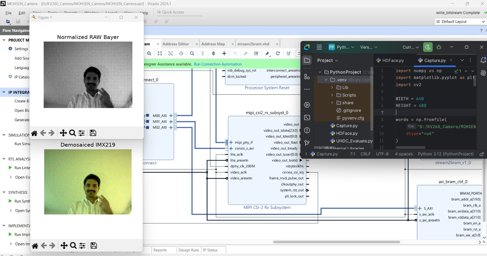
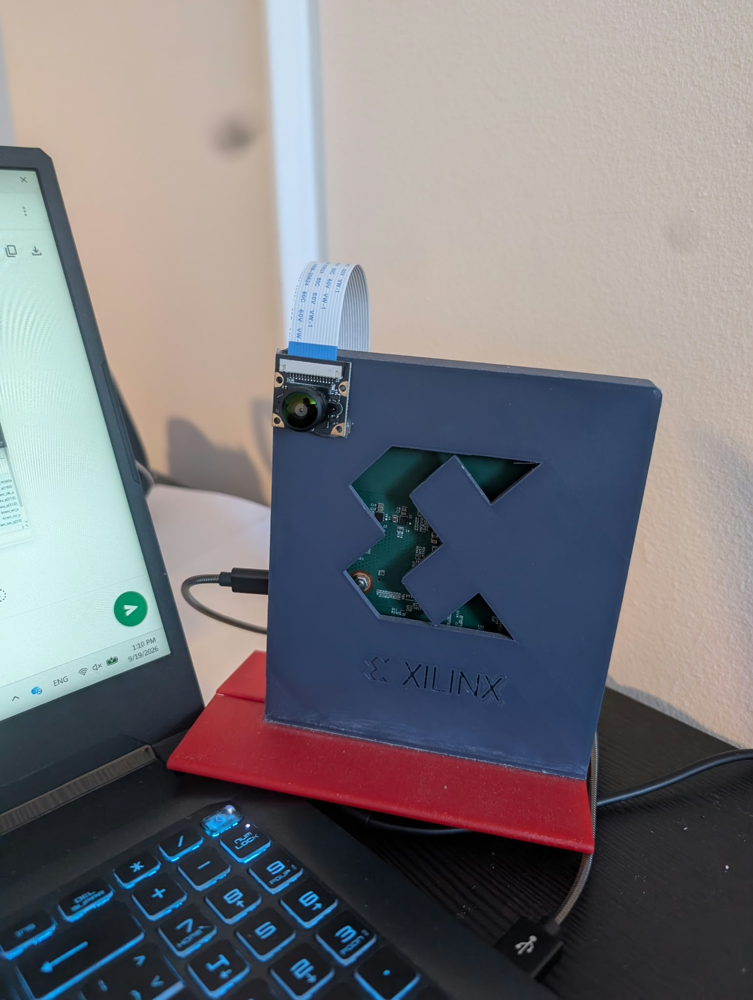

# KV260_IMX219
#vivado build
create a vivado project for KV260 and add the KV260 pin assignments.
1. ADD THE STREAM2BRAM VHDL
2. ADD THE CONSTRAINT FILE PIN.XDC
3. source the capture TCL file from TCL console
4. create HDL wrapper
5. synthesize the project and generate the XSA FILE

#SW
1. Create a Vitis platform with the generated XSA FILE
2. Create an application project and add the capture.c file to it
3. compile and RUN
4. from the debug prespective windo co to XSCT console and execute this
<pre>
mrd -size w -bin -file capture.bin 0xA0200000 262144
</pre>
5. the captured bin file is a RAW10 image of size 640x480, use the given capture.py code to see the image
6. Have fun

#Example

